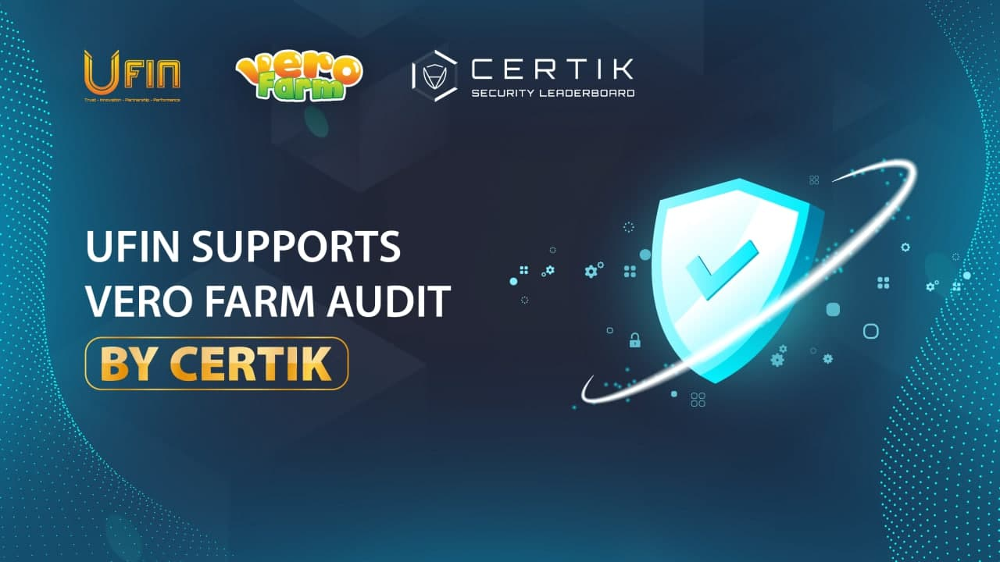

# UFIN Audits

✅Ufin supports Vero Farm Audit by CertiK

💥CertiK is a leading auditing company in Blockchain, and backed by Binance.

❗️CertiK has served over 100 CLIENTS and secured over $18 BILLION worth of digital assets with high-quality consulting and audit services

📌There are many succesful projects in Blockchain that be audited by CertiK such as: Sandbox, Terra, Universal Protocol, Arrington XRP Capital, Etherscan and so on

📌After Vero Farm was audited by TechRate, Ufin continues to support Vero Farm Audit by CertiK to ensure it's smart contract has the highest security for the community!

