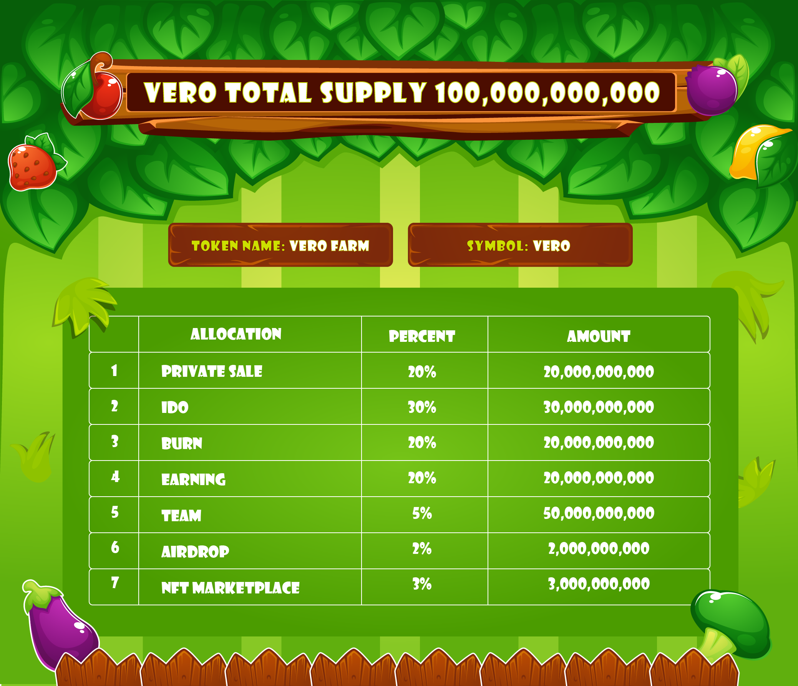

# Token Allocation

Total Supply: 100.000.000.000 VERO 

* 20% for the Private.
* 30% for the fair launch on Jlauchpad. We add 80% of token to LP on Pancakeswap.
* 20% Add Liquidity
* 20% for Play to Earn
* 2% for airdrop
* 5% for Teams
* 3% NFT Marketplace Protocol

