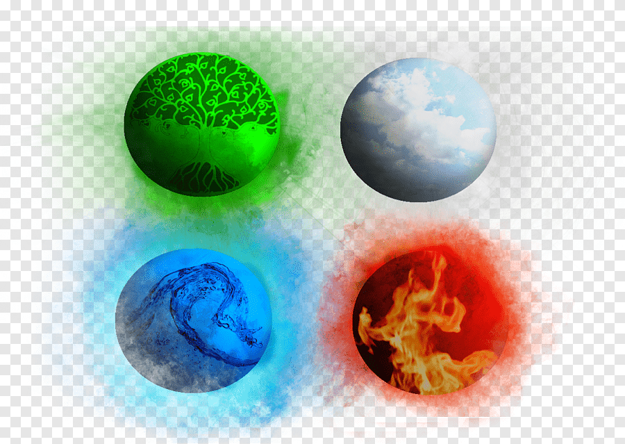

# Classical Elements

There are 4 groups of primordial elements that give rise to the Vero Farm' game universe.

| Elements | Mean |
| :--- | :--- |
| TERRA | Earth |
| AQUA | Water |
| AER | Air |
| IGNIS | Fire |

