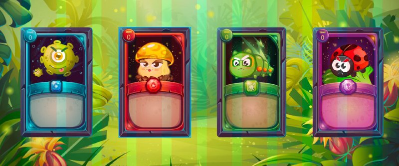

# Monsters

| Name | **Monsters** | Details |
| :--- | :--- | :--- |
| **Virion** | **virus** | This is a scary monster in the Vero farm that greatly affects plants |
| **Dikarya** | **Fungi** | Under the right humidity conditions, fungi will grow and multiply. In addition to pathogens and toxins, fungi can also be formidable plant pests. |
| **Archips** | **worm** | Worms are always cropped destroyers, attacking and eating all the young trees, the more beautiful the weather is, the more worms hatch from eggs and attack the farm.. |
| **Coccineus** | **Ladybug** | The farm's allied ladybugs, which infected the disease and mutated into monsters, now return to attack the creatures on the farm |

