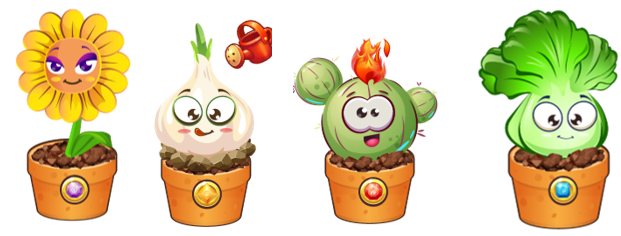

# Vero's Angel

| **Attribute** | Details |
| :--- | :--- |
| **Sunflower angel** | Sunflowers are always smiling, shining like the sun. It can blow the wind into a tornado at the opponent |
| **Garlic angel** | Garlic is extremely clever, it can shoot dirt and rocks at opponents |
| **Cactus angel** | Although Cactus is cheerful, it can sometimes be short-tempered. Cactus is capable of spewing fire or spewing thorns with fire by rotating or shaking its spiked arms. |
| **Cabbage angel** | Cabbage is very playful and has the ability to spray water from its mouth, vibrate to create dew like drops of water shot at the opponent |
|  |  |

\#NORMAL

